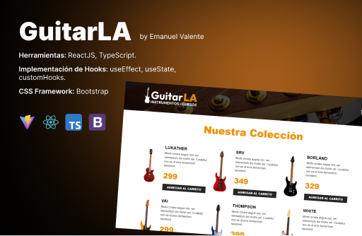

# React + TypeScript + Vite

This is a E-Cart simulation where users can add items to cart, increase and decrease quantity and remove them.

This project was made with Vite + React + Typescript. I use custom hooks too.

- Production link:

## Preview:

